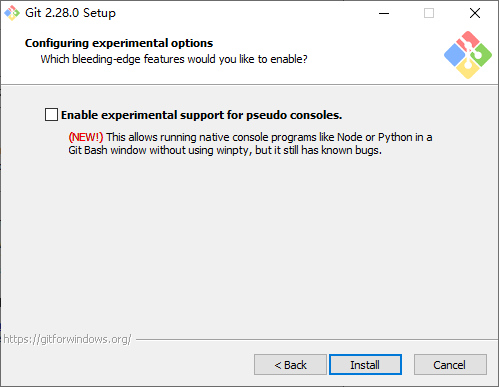
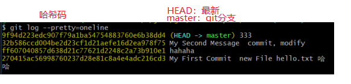
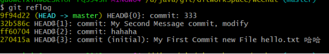
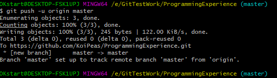
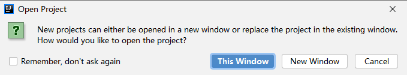

# 1、版本控制简介

## 1.1、Git简介

1. 官网地址：https://git-scm.com/

   Git是一个开源的分布式版本控制系统，用于敏捷高效地处理任何或小或大的项目。

   Git 是 Linus Torvalds 为了帮助管理 Linux 内核开发而开发的一个开放源码的版本控制软件。

   Git 与常用的版本控制工具 CVS, Subversion 等不同，它采用了分布式版本库的方式，不必服务器端软件支持。

   

2. GIT优点：

   - 大部分操作在本地完成，不需要联网
   - 完整性保证
   - 尽可能添加数据而不是删除或修改数据
   - 分支操作非常快捷流畅
   - 与 Linux命令全面兼容

## 1.2、什么是版本控制

版本控制最主要的功能就是追踪文件的变更。它将什么时候、什么人更改了文件的什么内容等信息忠实地了已录下来。每一次文件的改变，文件的版本号都将增加。除了记录版本变更外，版本控制的另一个重要功能是并行开发。软件开发往往是多人协同作业，版本控制可以有效地解决版本的同步以及不同开发者之间的开发通信问题，提高协同开发的效率。并行开发中最常见的不同版本软件的错误(Bug)修正问题也可以通过版本控制中分支与合并的方法有效地解决。

## 1.3、版本控制工具应该具备的功能

- **协同修改**
  多人并行不悖的修改服务器端的同一个文件。
- **数据备份**
  不仅保存目录和文件的当前状态，还能够保存每一个提交过的历史状态。
- **版本管理**
  在保存每一个版本的文件信息的时候要做到不保存重复数据，以节约存储空
  间，提高运行效率。这方面 SVN采用的是增量式管理的方式，而 Git采取了文
  件系统快照的方式。
- **权限控制**
  对团队中参与开发的人员进行权限控制。
  对团队外开发者贡献的代码进行审核——Git独有。
- **历史记录**
  查看修改人、修改时间、修改内容、日志信息。
  将本地文件恢复到某一个历史状态。
- **分支管理**
  允许开发团队在工作过程中多条生产线同时推进任务，进一步提高效

## 1.4、版本控制

### 1.4.1、版本控制

工程设计领域中使用版本控制管理工程蓝图的设计过程。在  IT开发过程中也可以
使用版本控制思想管理代码的版本迭代。

### 1.4.2、版本控制工具

1. 思想：版本控制
   实现：版本控制工具

2. 集中式版本控制工具：
   CVS、==SVN==、VSS……

   分布式版本控制工具：
   ==Git==、Mercurial、Bazaar、Darcs……

## 1.5、Git 与 SVN 区别

Git 与 SVN 区别点：

1. **Git 是分布式的，SVN 不是**：这是 Git 和其它非分布式的版本控制系统，例如 SVN，CVS 等，最核心的区别。
2. Git 把内容按元数据方式存储，而 SVN 是按文件：所有的资源控制系统都是把文件的元信息隐藏在一个类似 .svn、.cvs 等的文件夹里。
3. Git 分支和 SVN 的分支不同：分支在 SVN 中一点都不特别，其实它就是版本库中的另外一个目录。
4. Git 没有一个全局的版本号，而 SVN 有：目前为止这是跟 SVN 相比 Git 缺少的最大的一个特征。
5. Git 的内容完整性要优于 SVN：Git 的内容存储使用的是 SHA-1 哈希算法。这能确保代码内容的完整性，确保在遇到磁盘故障和网络问题时降低对版本库的破坏。


# 2、Git操作

## 2.1、Git安装

1. 双击安装程序，再点击“Next”下一步

   

2. 选择安装路径，再点击“Next”下一步

   

3. 设置git，一般不用设置，再点击“Next”下一步，再点击“Next”下一步

   

   

4. 设置git命令格式，再点击“Next”下一步

   

5. 设置Path，再点击“Next”下一步

   

6. 一直点击“Next”下一步

   

   

   

   

   

   

   

   

## 2.2、Git结构

Git 工作区、暂存区和本地（版本）库

1. **工作区**：就是你在电脑里能看到的目录(==写的代码存在工作区==）。
2. **暂存区**：英文叫stage, 或index。一般存放在 ".git目录下" 下的index文件（.git/index）中，所以我们把暂存区有时也叫作索引（index）。（==计划要提交的文件==）
3. **版本库**：**（本地库）**工作区有一个隐藏目录.git，这个不算工作区，而是Git的版本库。


## 2.3、Git和代码托管中心

### 2.3.1、代码托管中心

代码托管中心的任务：维护远程库

1. 局域网环境下：
    GitLab服务器
2. 外网环境下
   GitHub   https://github.com/
   码云     https://gitee.com/ 

### 2.3.2、本地库和远程库

 团队内部协作和跨团队协作

#### 2.3.2.1、团队内部协作流程：


#### 2.3.2.2、跨团队协作


## 2.4、Git命令行

> 右击桌面，选择“==Git Bash Here==”
>
> Git Bash命令同时支持Linux相关命令。


### 2.4.1、创建仓库（本地库）

#### 2.4.1.1、初始化本地仓库

1. Git 使用 `git init` 命令来初始化一个 Git 仓库，Git 的很多命令都需要在 Git 的仓库中运行，所以 `git init` 是使用 Git 的第一个命令。
   在执行完成 `git init` 命令后，Git 仓库会生成一个 .git 目录，该目录包含了资源的所有元数据，其他的项目目录保持不变（不像 SVN 会在每个子目录生成 .svn 目录，Git 只在仓库的根目录生成 .git 目录）。

   

2. 初始化后，会在 WeChat 目录下会出现一个名为 .git 的目录，所有 Git 需要的数据和资源都存放在这个目录中。

   查看隐藏的.git文件内容：
     `ll –A`    -a/A  表示查看隐藏文件
     `ll .git/`     表示查看.git 下的文件列表显示

   

> 注意：.git目录是存放本地库相关的目录和文件，不要对其进行修改和操作。


#### 2.4.1.2、设置签名

##### ①、签名概述

1. ==签名的作用：用于标识不同的开发人员（身份）==

2. **形式**：
         用户名：weixin
         Email邮箱：315759265@qq.com
   
     > 【注意】：这里的签名和远程库（代码拖管中心GitHub/GitLab）无任何关系。
     
3. **项目级别（仓库）**：仅在当前本地库范围有效
       (此处的WeChat)

4. **系统级别**：登录当前操作系统的用户范围

5. 开始—》窗口—》

6. **级别优先级：**

    就近原则：项目级别优先级大于系统(用户)级别签名

   **注意：**(签名级别必须要设置，如果都不设置，GIT可能会导致命令出差。无法辨别)

##### ②、签名命令

1. `git config`

   ```shell
   # 项目级别（仓库）：仅在当前本地库范围有效
   git config user.name weixin_pro
   git config user.email 315759265_pro@qq.com
   
   # 系统级别：登录当前操作系统的用户范围
   git config –-global user.name weixin_global
   git config –-global user.email 315759265_global@qq.com
   ```

   

2. 查看设置结果：

   ```shell
   cat config
   ```

   

==在实际开发过程中，通常只需要设置系统级别即可。如果有特殊需要，再设置项目级别。==

### 2.4.2、常用命令

#### ①、git status

- 格式

  ```shell
  git status [<options>…] [--] [<pathspec>…]
  ```

  

- `git status`==命令用于显示工作目录和暂存区的状态==。使用此命令能看到那些修改被暂存到了, 哪些没有, 哪些文件没有被Git tracked到。`git status`不显示已经==commit==到项目历史中去的信息。看项目历史的信息要使用`git log`

- 在工作空间中创建“java.txt”文件，查看git status能看到信息提示：

  

#### ②、git add

- `git add hello.txt`命令==将文件内容添加到索引(将修改添加到暂存区)==。也就是将要提交的文件的信息添加到索引库中。（将工作区写入暂存区）

  描述：此命令将要提交的文件的信息添加到索引库中(将修改添加到暂存区)，以准备为下一次提交分段的内容。

- git add 后，再次查询git status

  

#### ③、git rm

- `git rm`==命令用于从工作区和索引中删除文件。==

- 格式

  ```shell
  git rm [-f | --force] [-n] [-r] [--cached] 
  [--ignore-unmatch] [--quiet] [--] <file>…
  ```

- 用于将暂存区的文件恢复到工作区

  ```shell
  git rm –cached  文件名称   # 用于将暂存区的文件恢复到工作区
  ```

#### ④、git commit

- `git commit`命令用于==将更改记录(提交)到存储库==。将索引的当前内容与描述更改的用户和日志消息一起存储在新的提交中。

- 执行命令：`git commit 文件名.后缀名`后，显示如下需要输入提交文件的备注或描述。
  ==可通过:set nu 显示行号方式便利输入备注信息==

  

  按下“esc”按钮，输入“:wq”保存退出，即可提交成功

  

- 快速备注

  ```shell
  git commit  -m “备注信息”文件名    # 快速加入备注描述
  ```

  

  

#### ⑤、git checkout

- `git checkout`命令==用于切换分支或恢复工作树文件（回滚到版本库中）==。`git checkout`是git最常用的命令之一，同时也是一个很危险的命令，因为这条命令会重写工作区。

  

#### ⑥、git log

- `git log`命令用于==显示提交日志信息。==

- 格式

  ```shell
  git log [<options>] [<revision range>] [[\--] <path>…]
  ```

  

  缺点：出现一长溜，不好看

- 通过如下方式更优雅的显示(查看历史记录)：

  - git log –-pretty=oneline 

    比之前好看

    

  - Git log --oneline

    哈希码太长，可以变短

    

  - git reflog   //用于显示需要回退的步骤HEAD@{ * }

    

#### ⑦、git reflog/reset查看(设置)历史记录(之前/之后)：

- `git reset`命令用于将当前==HEAD==复位到指定状态。一般用于撤消之前的一些操作(如：==git add,git commit==等)。

- HEAD@{移动到当前版本需要多少步}

- 基于索引值操作[推荐]
  git reset --hard [局部索引值]

- 查看当前版本记录：

  

- 通过`git reset --hard [局部索引值]`跳到指定版本

  

#### ⑧、永久删除后找回

- `git rm`命令用于从工作区和索引中删除文件。

  - 工作区创建文件，通过命令提交到本地库

    ```shell
    Vim d1.txt           # 创建d1文件  
    git add d1.txt       # 添加到版本库
    git commit –m ‘上传到本地库d1.txt’ d1.txt # 提交到版本库
    ```

    

  - 执行命令进行删除：

    ```shell
    git rm d1.txt 工作区删除后，提交到本地库    # 执行删除命令
    git commit –m ‘删除d1.txt’ d1.txt       # 提交到版本库
    ```

    

  - 通过日志git reflog 找回

    ```shell
    $ git reset --hard 15d5002    # 恢复到历史版本
    ```

    

  - `ll`查看即可。

  ==注意：git只要在本地库发生操作，都会进行版本记录。==

#### ⑨git diff

- `git diff`命令==用于显示提交和工作树等之间的更改==。此命令比较的是工作目录中当前文件和暂存区域快照之间的差异,也就是修改之后还没有暂存起来的变化内容。==(默认是和暂存区文件进行比较)==

- gid diff 将工作区中的文件和暂存区进行比较

  

- gid diff 暂存区中的文件和本地库进行比较

  ```shell
  git diff HEAD git.txt   # HEAD代表本地库最新版本指针
  ```

- 所有文件比较

  ```shell
  git diff     # 不加文件名
  ```

  

## 2.5、分支

### 2.5.1、分支概念

1. 什么是分支？
   在版本控制过程中，使用多条线同时推进多个任务。

   

2. 分支的好处？

   - 同时并行推进多个功能开发，提高开发效率
   - 各个分支在开发过程中，如果某一个分支开发失败，不会对其他分支有任何影响。
   - 失败的分支删除重新开始即可


### 2.5.2、分支命令（操作）

`git branch`命令==用于列出，创建或删除分支。==
`git checkout`命令==用于切换分支或恢复工作树文件。==

```shell
# 查看当前有哪些分支
git  branch    
# 新建一个分支
git branch hot_fix

# 切换到指定分支
git checkout hot_fix

# 查看本地和远程分支
git branch –a
```


示例：合并分支：
 1、在分支hot_fix 上修改git.txt文件，并提交到本地库
 2、需要合并分支。让master上的git.txt同步

```shell
# 切换到接受修改的分支上master（将hot_fix内容同步到master）
git checkout master   # 切换到接受修改的分支上
# 执行merge命令
git merge   # 命令用于将两个或两个以上的开发历史加入(合并)一起。
git merge hot_fix  # hot_fix 被合并的分支名称
```


### 2.5.3、合并分支（冲突）解决

问题：将两个分支内的文件分别进行修改.（且改变的是同一位置）进行合并。

1. 查看分支信息：

   ```shell
    git branch -v
   ```

   

2. 在master下修改某行文件内容。然后进行提交。

   ```shell
   vim git.txt  
   git add git.txt
   git commit –m ‘master 提交’ git.txt
   ```

   

3. 查看分支信息

   ```shell
   git branch -v
   ```

   

4. 在hot_fix下修改某行（master）同行文件内容。然后进行提交

   ```shell
   git checkout hot_fix
   vim git.txt
   git add git.txt
   git commit –m ‘hot_fix提交’ git.txt
   ```

   

5. 查看版本信息：

   

6. 合并：

   ```shell
   git merge master    # 在hot_fix中向master中合并代码
   ```

   


# 3、github

## 3.1、简介

gitHub是一个面向[开源](https://baike.baidu.com/item/开源/20720669)及私有[软件](https://baike.baidu.com/item/软件/12053)项目的托管平台，因为只支持git 作为唯一的版本库格式进行托管，故名gitHub。

gitHub于2008年4月10日正式上线，除了git代码仓库托管及基本的 Web管理界面以外，还提供了订阅、讨论组、文本渲染、在线文件编辑器、协作图谱（报表）、代码片段分享（Gist）等功能。目前，其注册用户已经超过350万，托管版本数量也是非常之多，其中不乏知名开源项目 [Ruby](https://baike.baidu.com/item/Ruby/11419) on Rails、[jQuery](https://baike.baidu.com/item/jQuery/5385065)、[python](https://baike.baidu.com/item/python/407313) 等。

2018年6月4日，微软宣布，通过75亿美元的股票交易收购代码托管平台GitHub。

### 3.1.1、注册账户

github官网地址：https://github.com/


### 3.1.2、访问过慢

1. 由于GitHub是一个国外网站。我们通过浏览器访问下https://github.com，但是页面很久才能打开，要等待一个较长时间

2. 优化思路：通过绕过DNS解析，直接在本地绑定host
   在浏览器中打开 https://github.com.ipaddress.com/

   

3. 需要在host文件里做些修改【C:\Windows\System32\drivers\etc】
   找到host文件：

   ```java
   140.82.112.3	github.com
   199.232.5.194	github.global.ssl.fastly.net
   ```

4. 在cmd中刷新dns缓存命令

   ```shell
   ipconfig /flushdns
   ```

   

## 3.2、仓库操作

### <a id="createCK">3.2.1、创建仓库</a>

1. 
2. 


### <a>3.2.2、本地仓库连接远程仓库</a>a

1. 在github上创建远程仓库【3.2.1、创建仓库】
   在本地磁盘上创建工作仓库【2.4.1、创建仓库（本地库）】

2. 在本地库创建远程库别名

   ```shell
   git remote –v  # 查看远程库的信息
   ```

   

3. 将远程仓库的地址添加到本地仓库中

   ```shell
   git remote add origin https://github.com/KoiPeas/ProgrammingExperience.git   # origin 是别名
   git remote -v
   ```

   

   

### 3.2.3、文件操作

#### 3.2.3.1、推送操作（push）


```shell
git push –u origin master   # origin 别名 master分支。执行之后，弹出github账号密码对话框，输入后登陆即可
```



> 注意：出现 error: failed to push some refs to 'https://github.com/KoiPeas/ProgrammingExperience.git'
>
> 问题：则是有文件没有提交，需要执行
>
> 解决：
>
> ```shell
> $ git pull origin master    #
> $ git push -u origin master
> ```
>
> 若还是不能解决，则需要手动提交

#### 3.2.3.2、克隆操作（clone）


1. clone 命令
   `git clone`命令==将存储库克隆到新目录中。==
   // -b master 用于指定clone的分支名称

   ```shell
   git clone https://github.com/KoiPeas/ProgrammingExperience.git
   # 执行之后，弹出github账号密码对话框，输入后登陆即可
   ```


2. clone会做三件事：
   1. 完整的把远程库下载到本地
   2. 创建origin远程地址别名
   3. 初始化本地库


#### <a id="invitation">3.2.3.3、项目经理邀请</a>

1. 项目经理设置分享

 

 弹出的对话框中，输入要邀请的人员，选择后，点击按钮”Add zhangsan to xiuangmu“


2. 其他人员连入仓库

发送邀请到对方账户上，开发人员点击连接即可加入

 


#### 3.2.3.4、提交代码

```shell
git push origin master
# 执行之后，弹出github账号密码对话框，输入后登陆即可
```

 

 

#### 3.2.3.5、项目经理拉取代码

##### ①、操作步骤1 git pull

1. `git pull`：相当于是==从远程获取最新版本并merge到本地==
   ==git pull origin master    //相当于git fetch 和 git merge==

2. `git pull`命令用于==从另一个存储库或本地分支获取并集成(整合)。==

   git pull命令的作用是：取回远程主机某个分支的更新，再与本地的指定分支合并。

   - 重复之前动作（开发人员提交代码）

   - Pull命令拉取： pull==fetch +merge

     ```shell
     git pull demo master   #  demo远程地址别名 master分支
     ```

##### ②、操作步骤2

1. 本地库文件目录（项目经理）：

2. 从github上fetch代码
   `git fetch`命令用于从==另一个存储库下载对象和引用。==

   ```shell
   $ git fetch origin master   # 更新远程跟踪分支origin别名 master 指定分支
   ```

   

3. fetch抓取只是将远程文件下载到本地（并未改变）
   通过`cat hello.txt`查看文件

4. 本地可查看远程提交的文件内容（通过切换分支查看）

   ```shell
   git checkout  demo/master  # 查看远程分支代码
   ```

5. 合并（将远程库合并到本地master）

   ```shell
   git checkout master   # 回到本地master
   git merge demo/master
   ```

   

# 4、idea操作git

## 4.1、idea配置git

### 4.1.1、idea设置git

1. 进出File → Settings → Version Control → Git、

   

   

### 4.1.2、将目添加到git中

1. 进入VCS → Import into Version Control → Create Git Repository


2. 选择项目后，点击“OK”

   - 之后项目就会出现“git的操作按钮”并且项目出现“.git“文件夹

   

   - 右击项目，也会出现git快捷菜单
   - 
   - 项目中的文件变为棕色


### 4.1.3、项目操作（项目经理提交代码）

1. 将项目添加到git中：右击项目 → Git → Add。之后项目变绿

   

2. 将项目提交到git的本地库中：右击项目 → Git → Add → commitDirectore

   

3. 将项目从本地库push到远程库

   - 步骤1：在github上创建远程仓库（[【3.2.1、创建仓库】](#createCK)）

   - 步骤2：项目经理要将本地库push到远程库：File → Settings → Version Control → GitHub，点击”Add account“，弹出的登陆对话框，登陆账号

   - 步骤3：设置本地仓库的所连接的远程仓库地址：右击项目 → Git → Repository → Remotes。

     

   - 执行push命令：右击项目 → Git Repository → Push

     


### 4.1.4、开发人员远程仓库clone代码

1. 复制项目在远程仓库的地址

   

2. 创建一个新项目，执行克隆：VCS → Git from Version Control
   或 不创新一个新项目，执行克隆：File → New → Project from Version Control

   

   clone成功后，弹出对话框，是否打开项目

   


### 4.1.5、修改代码提交

1. 修改代码后，文件颜色变为 蓝色

   

2. 提交代码到本地仓库：右击项目 → Git → Commit File

   

3. 项目经理邀请开发人员的github账号（[【3.2.3.3、项目经理邀请】](#invitation)）

4. 执行push命令：右击项目 → Git Repository → Push

   


### 4.1.6、项目经理获取修改代码

1. 执行pull命令：右击项目 → Git Repository → pull

   


## 4.2、代码冲突

### 4.2.1、处理代码冲突

> 1. 提交代码之前，先将代码pull一下，获取最新代码
> 2. 提交冲突代码时，会提示用户有冲突

1. 提交代码时，若代码有冲突，则会弹出对话框

   

2. 点击对话框”Merge“，查看有哪些文件有代码冲突
   Accept Yours：同意自己的代码，删除远程仓库的服务器代码

   Accept Theirs：同意远程仓库代码，删除自己的代码

   

   

3. 点击对话框中的冲突文件，进入明细页面

   

   详情页面分为三栏，左边为本地版本，中间为修改前版本，右边为服务器最新版本，左右两边代码不可以修改


### 4.2.2、代码冲突建议

1. ==修改文件之前，先进行一次update操作==
2. ==修改完成后，及时commit，不要在本地停留过长时间==


